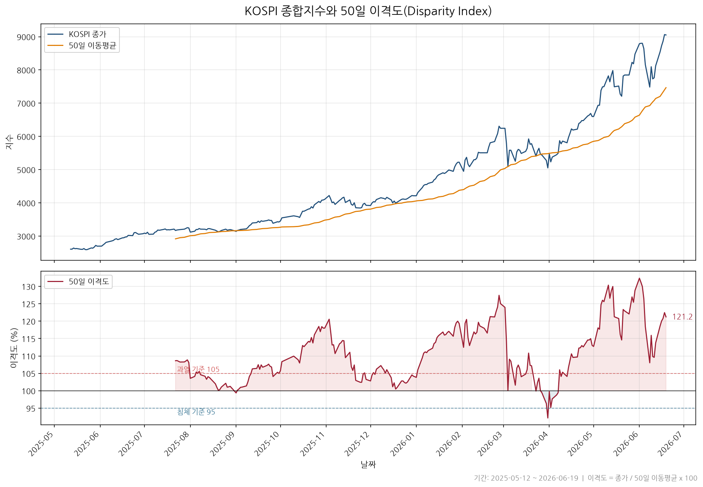

# KOSPI 50일 이격도(Disparity Index) 차트

KOSPI 종합지수(^KS11)의 **50일 이격도** 차트를 생성하는 스크립트입니다.

> 이격도(Disparity Index) = (종가 / N일 이동평균) × 100
>
> - **100** : 주가가 이동평균선과 일치
> - **>100** : 주가가 이동평균선 위 (단기 과열 신호)
> - **<100** : 주가가 이동평균선 아래 (단기 침체 신호)



## 실행

```bash
pip install matplotlib pandas
python3 kospi_disparity.py                 # 50일 이격도 (기본)
python3 kospi_disparity.py --window 20     # 20일 이격도
python3 kospi_disparity.py --out chart.png # 출력 경로 지정
```

## 데이터

- 기본값은 로컬 CSV(`data/kospi.csv`)를 사용합니다. KOSPI 종합지수 일별
  종가이며 기간은 **2025-05-12 ~ 2026-06-19** 입니다.
  (2026-06-19 종가 9,052.42 / 50일 이동평균 7,466.78 → 이격도 **121.2**)
- 네트워크가 가능한 환경에서는 최신 데이터를 받아 쓸 수 있습니다:

  ```bash
  pip install finance-datareader   # 또는 yfinance
  python3 kospi_disparity.py --source live
  ```

## 파일

| 경로 | 설명 |
|------|------|
| `kospi_disparity.py` | 이격도 계산 및 차트 생성 스크립트 |
| `data/kospi.csv` | KOSPI 일별 지수 데이터 |
| `fonts/NanumGothic.ttf` | 차트 한글 렌더링용 폰트 (OFL) |
| `kospi_disparity.png` | 생성된 차트 이미지 |
